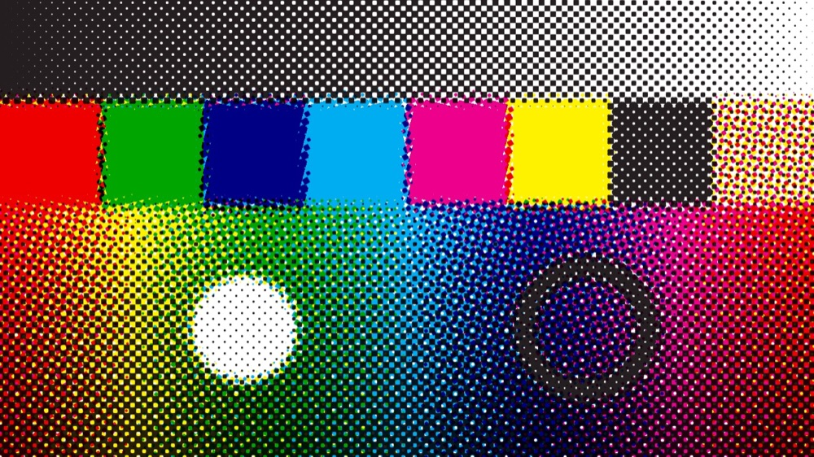

# Rosette

> **AI-assisted project.** This codebase was created with [Claude](https://claude.com/claude-code)
> (Anthropic), directed and reviewed by a human author. The printing model is
> not asserted but measured: an offline harness drives the real plugin class in
> a headless GL context and checks each physical claim against an independent
> statement of the same arithmetic — the GLSL spot functions against their C++
> originals over **264,196 points with zero disagreements past 1e-5**, printed
> area against the dot-gain curve to **1%**, a screen angle recovered from the
> dots' own centroids to **0.06°**, a registration offset to **0.05 px**, and
> two solid inks overprinting **bit-exactly** as the ink colours predict (see
> [Status](#status)). It has since been **registered, loaded and instantiated
> in Resolume Arena 7.27.1** on Windows, with its shaders compiling — but on a
> software rasteriser, never on a GPU in Resolume, and never in Arena on macOS.
> Check it in your own rig before trusting it in a show.

Offset litho as an FFGL effect for [Resolume](https://resolume.com) Arena and
Avenue.



<sub>The repo's test card through the plugin at a coarse screen — rendered by
`rztest`, the offline harness, not captured from Resolume.</sub>

<!-- downloads:start -->

## Download

**[v0.1.0](https://github.com/stoatworks-labs/rosette/releases/tag/v0.1.0)** — prebuilt for macOS and Windows. Pick your platform:

<details>
<summary><b>macOS</b> — Universal (Apple Silicon + Intel)</summary>

| Build | Download | Size |
| --- | --- | --- |
| Universal (Apple Silicon + Intel) · .dmg disk image | [`rosette-0.1.0-macos-universal.dmg`](https://github.com/stoatworks-labs/rosette/releases/download/v0.1.0/rosette-0.1.0-macos-universal.dmg) | 218 KB |
| Universal (Apple Silicon + Intel) · .zip archive | [`rosette-macos-universal.zip`](https://github.com/stoatworks-labs/rosette/releases/latest/download/rosette-macos-universal.zip) | 181 KB |

</details>

<details>
<summary><b>Windows</b> — x64</summary>

| Build | Download | Size |
| --- | --- | --- |
| x64 · .exe installer | [`rosette-0.1.0-windows-x86_64-setup.exe`](https://github.com/stoatworks-labs/rosette/releases/download/v0.1.0/rosette-0.1.0-windows-x86_64-setup.exe) | 223 KB |
| x64 · .zip archive | [`rosette-windows-x86_64.zip`](https://github.com/stoatworks-labs/rosette/releases/latest/download/rosette-windows-x86_64.zip) | 116 KB |

</details>

All builds, checksums and release notes: [github.com/stoatworks-labs/rosette/releases](https://github.com/stoatworks-labs/rosette/releases).

macOS builds are signed and notarised and open normally. The Windows builds are unsigned, so SmartScreen warns once.

<!-- downloads:end -->

## A printed picture is four plates and a press

That is the whole design, and everything else follows from it.

A halftone is not a texture laid over a picture. It is four **plates** — cyan,
magenta, yellow and black — each a lattice of dots at its own **screen angle**,
laid down one after another by a **press** that never quite registers them.
Model those two things and the rest is a consequence rather than an effect:

- **Rosettes.** Put the four lattices at the standard angles — C 15°, M 75°,
  Y 0°, K 45° — and they interfere into the flower printers recognise. Nothing
  draws it. It is what four screens at those angles *do*.
- **Moiré.** Set two screens to the same angle, or one degree apart, and you get
  the coarse beat that costs a print run. The **Moiré** preset puts magenta at
  16° against cyan's 15°, and it is real interference between two lattices, not
  a texture pretending to be one.
- **Misregistration** is per plate, in pixels, and it **wanders** as the press
  runs — a slow, bounded drift that puts colour fringes on every edge and moves
  them. Audio can shake the press.
- **Dot gain.** Ink spreads into paper, so the midtones fatten. Fifteen points
  is a litho press; thirty is newsprint.
- **Overprint.** Inks are filters, not lights. They multiply, which is why cyan
  over yellow is green and why black over anything is black.

**Solo** a plate to see its lattice on its own, which is how the angles and the
screen are actually set.

## The controls

**Separation** — Black Generation (how much of the neutral component moves off
the CMY plates onto the black one: 0 prints greys as equal parts cyan, magenta
and yellow, 1 prints them as black alone) and Total Ink, the limit on how much
ink one point may carry, 200% to 400%.

**Screen** — Screen (2 to 40 px per dot), Dot Shape, Dot Gain, Ink Spread, and
an angle per plate.

Four dot shapes, and they are spot functions rather than sprites. **Round**
grows a near-circle, turns over through a checkerboard at exactly 50%, and
inverts into holes. **Elliptical** is the same function with the metric
stretched, so the dot meets its row neighbours first and chains along the screen
angle — which is what an elliptical screen is for: no abrupt flip at the
midtone. **Square** never inverts. **Line** is a band.

**Press** — a registration offset in x and y for each of the four plates, Press
Wander and Wander Speed, and an audio input with Audio Drive.

**Ink** — the four ink colours and the paper, as colour pickers, plus Ink
Density, a switch per plate and Solo.

**Output** — Mix.

**Six presets:** Offset Litho, Newspaper, Riso 2-Colour, Silkscreen, Moiré,
Drifting Press. Riso is two plates — the cyan separation on a Riso blue, the
magenta on fluorescent pink — with no black, no yellow, a coarse screen, a press
that drifts and the paper showing through, which is most of what makes a Riso
look like one.

## Audio

Resolume hands a plugin a 64-bin spectrum once per frame. Rosette follows it two
ways at once, because a press has two kinds of error: the level jitters the
plates continuously, and a detected onset **throws** them, each in its own
direction, decaying until the next hit. Audio Drive is zero by default, so with
nothing routed this is an ordinary manual halftone and behaves like one.

It is a modulation source at video rate, not a signal source: the smallest
interval it can resolve is a frame, so a kick lands up to 17 ms late at 60 fps.

## Build

Needs CMake and the Resolume FFGL SDK, which is a submodule.

```bash
git clone --recursive https://github.com/stoatworks-labs/rosette
cd rosette
cmake -B build -DCMAKE_BUILD_TYPE=Release
cmake --build build
cmake --install build    # → ~/Documents/Resolume Arena/Extra Effects
```

macOS builds universal (arm64 + x86_64) by default. Add
`-DCMAKE_OSX_ARCHITECTURES=arm64` for a faster development build.

## Building and testing

The harness renders the real plugin class headlessly, and every check below
measures rather than previews:

    ./build/rztest --out /tmp/frame.png     the test card, printed
    ./build/rztest --list                   every parameter, kind and default
    ./build/rztest --spot                   the GLSL spot functions vs the C++
    ./build/rztest --gain                   printed area vs the dot-gain curve
    ./build/rztest --angle                  a lattice's angle, off its centroids
    ./build/rztest --register               an offset moves the dots by that much
    ./build/rztest --overprint              two solids multiply as predicted
    ./build/rztest --identity               the CMYK round trip
    ./build/rztest --audio                  silence, and a beat
    ./build/rztest --bench                  720p through 4K
    python3 tools/sweep.py                  no control is silently dead
    tools/verify.sh                         all of it, on a fresh universal build

## Status

**v0.1.0, and honestly early.** Verified by measurement on an M4 Max, macOS
26.4, 2026-09-21:

| Check | Result |
| --- | --- |
| GLSL spot functions vs C++ | 4 shapes × 66,049 points — **264,196 comparisons, 0 disagreements** past 1e-5; largest difference 1.79e-07 |
| Printed area vs the dot-gain curve | 6 shape-and-gain cases over 20 tone bands — worst band off by **0.0099** of full area |
| Screen angle | 45°, 15°, 75° and 20° recovered from ~1,550 dot centroids to within **0.06°**; pitch 15.95–15.98 px for a 16 px screen |
| Registration | offsets of (+3, −2), (−5, +7) and (+0.5, +0.25) px move every dot by exactly that, worst disagreement **0.0491 px** |
| Overprint | C over Y, C over M, M over Y and all three — **every pixel exact**, 0/255 |
| CMYK round trip | with no plate screened, **0.0016**; with a screened plate, 0.0415 at a 2 px cell falling to 0.0069 at 16 px |
| Press wander | bounded (9.545 of 10 px), smooth (0.2174 px/frame), different per plate (8.15 px apart), exactly zero at zero |
| Audio | silence moves nothing at full drive; 3 onsets in two seconds; plates thrown 23.6 px |
| No dead controls | all **44 sweepable** of the **49** parameters the plugin declares measurably change the picture; the other five are the FFT buffer and the four About buttons, which `tools/sweep.py` skips for stated reasons |
| macOS binary | a local build is universal (`x86_64 arm64`), exports `plugMain`, and ad-hoc signs |
| Host metadata | `oxbow probe` reads **SW Rosette / RZ01 / effect** |
| Render cost | 0.15 ms/frame at 720p, 0.23 at 1080p, 0.50 at 4K — 3% of a 60 fps frame |

Run `tools/verify.sh` before believing any of it.

**In a real host, once.** On 2026-09-21 an x64 Windows DLL was cross-compiled
in the Parallels guest on this Mac (ARM64 Windows 11, MSVC 2022 Build Tools,
`cmake -A x64`, vcpkg triplet `x64-windows-static-md` — there is no x64 Windows
machine in the *local* build loop) and taken to win-lab, an x64 Windows 11 Pro VM
with **no GPU**, where OpenGL comes from Mesa llvmpipe dropped in beside Arena.
That is the build in the table below; the released DLL is a separate one, built on
a GitHub runner, and has not been in front of Arena:

| Check | Result |
| --- | --- |
| Windows binary | `Rosette.dll`, **380,928 bytes**, `dumpbin /EXPORTS` shows `plugMain` |
| Arena registers it | Resolume Arena 7.27.1 (build 15990) lists `SW Rosette` among 112 video effects, under `idstring` **`RZ01`**, with the description the plugin declares |
| Arena loads the DLL | `plugin loaded build=<stamp>` in the plugin's own diag log, carrying the stamp of the DLL built minutes earlier |
| Arena instantiates it, and the shaders compile | applied from Arena's own effects browser; the log reads `GL vendor=Mesa renderer=llvmpipe (LLVM 22.1.8, 256 bits) version=4.5 (Core Profile) Mesa 26.2.0` and then `initialised`, and Arena drew its inspector, groups and all |
| Headless on x64 Windows | `oxbow selftest`: **120 frames, gl error 0x0, PASS**, 921,600/921,600 lit pixels (100%) |
| The log | clean of WARN, ERROR and FAIL |

That was a software rasteriser throughout, so it says nothing about speed:
**no frame timing was taken on Windows**, and the ms/frame figures above remain
macOS-only. The effect was applied to the composition rather than to a clip, so
the proof of instantiation is the diag log, not the clip's effect list.

**Not yet done.** It has **never run on a GPU in Resolume** — the one host run
was on llvmpipe — and it has **never been instantiated in Arena on macOS**.
Arena drew an inspector for it, but nothing in that inspector was checked
beyond its appearing, so how the parameters *present* — whether the 49 controls
in six groups read sensibly, whether the five colour triples show as swatches —
is still untested. No real audio has reached the plugin in a host; the audio
path is still only exercised by the harness's synthetic spectra, and
Resolume's 64-bin FFT mapping is assumed rather than measured. No long session,
no composition save or reload and no preset recall were exercised in the host,
and whether the plugin settles on Resolume's clock unit is unconfirmed — see
[AGENTS.md](AGENTS.md). CI, which builds macOS and x64 Windows, and the release
workflow have both run and passed on GitHub. There is no OpenFX port and no
browser demo; neither is required for 0.1.0. `ATTRIBUTIONS.md` is still a
provisional hand copy, and there is no user guide, so the About block
deliberately carries no guide link.

[AGENTS.md](AGENTS.md) has the full list of what is assumed rather than
measured, and the traps.

## Licence

MIT — see [LICENSE](LICENSE) and [ATTRIBUTIONS.md](ATTRIBUTIONS.md).
