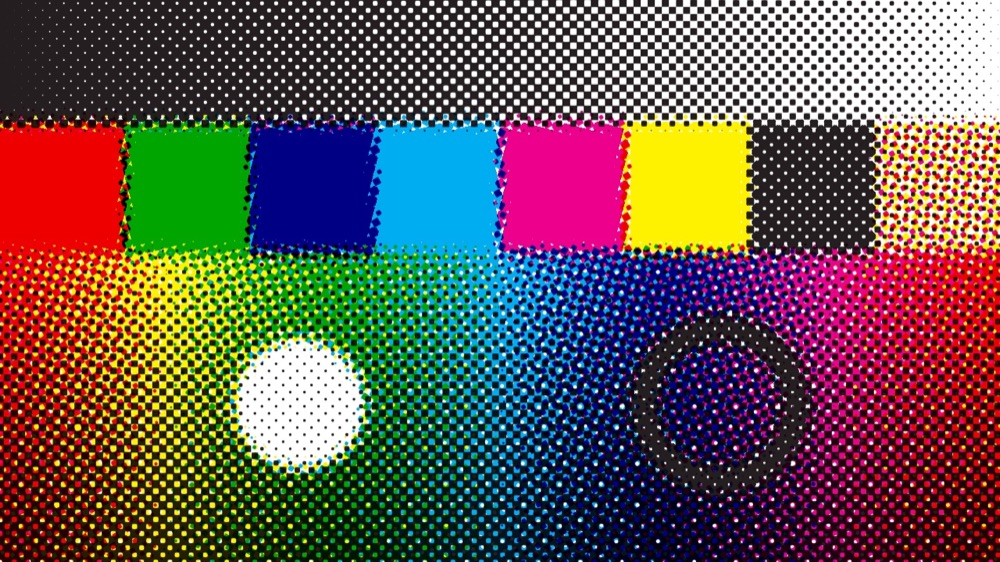
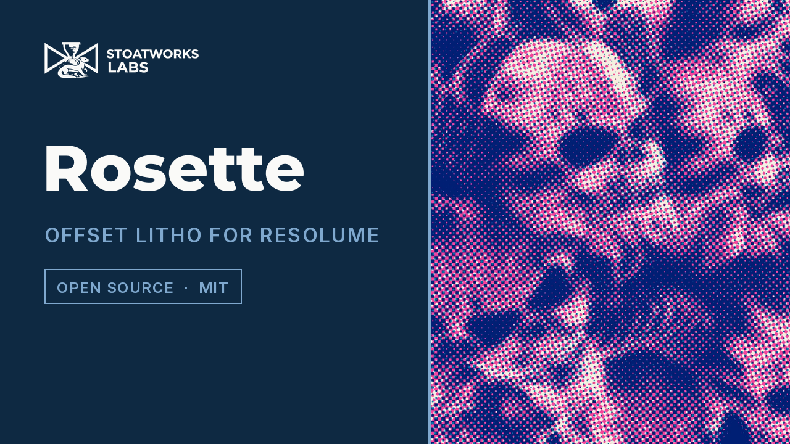

# Rosette

> **AI-assisted project.** This codebase was created with [Claude](https://claude.com/claude-code)
> (Anthropic), directed and reviewed by a human author. The printing model is
> not asserted but measured: an offline harness drives the real plugin class in
> a headless GL context and checks each physical claim against an independent
> statement of the same arithmetic — the GLSL spot functions against their C++
> originals over **264,196 points with zero disagreements past 1e-5**, printed
> area against the dot-gain curve to **1%**, a screen angle recovered from the
> dots' own centroids to **0.06°**, a registration offset to **0.05 px**, and
> two solid inks overprinting **bit-exactly** as the ink colours predict (see
> [Status](#status)). It has since been **registered, loaded and instantiated
> in Resolume Arena 7.27.1** on Windows, with its shaders compiling — but on a
> software rasteriser, never on a GPU in Resolume, and never in Arena on macOS.
> The [OpenFX build](#openfx--resolve-vegas-nuke-natron) prints on the CPU and
> is held against the GPU pixel for pixel — the same card through both comes
> out identical in **over 99% of pixels**, a mean of **0.002/255** apart — and
> in DaVinci Resolve Studio 21.1 on macOS, as a Fusion tool, it renders
> **byte-identical** to the test host. It has never been in Vegas, Nuke or
> Natron, and its Windows and Linux builds have never rendered in a host.
> Check it in your own rig before trusting it in a show.

Offset litho as an FFGL effect for [Resolume](https://resolume.com) Arena and
Avenue, and an [OpenFX](https://openeffects.org) effect for DaVinci Resolve,
Vegas, Nuke and Natron.



<sub>The repo's test card through the plugin at a coarse screen — rendered by
`rztest`, the offline harness, not captured from Resolume.</sub>

<!-- downloads:start -->

## Download

**[v0.2.0](https://github.com/stoatworks-labs/rosette/releases/tag/v0.2.0)** — prebuilt for macOS, Windows and Linux. Pick your platform:

<details>
<summary><b>macOS</b> — Universal (Apple Silicon + Intel)</summary>

| Build | Download | Size |
| --- | --- | --- |
| Universal (Apple Silicon + Intel) · .dmg disk image | [`rosette-0.2.0-macos-universal.dmg`](https://github.com/stoatworks-labs/rosette/releases/download/v0.2.0/rosette-0.2.0-macos-universal.dmg) | 235 KB |
| Universal (Apple Silicon + Intel) · .zip archive | [`rosette-macos-universal.zip`](https://github.com/stoatworks-labs/rosette/releases/latest/download/rosette-macos-universal.zip) | 192 KB |
| Universal (Apple Silicon + Intel) · .zip archive (OpenFX — Resolve, Vegas, Nuke) | [`rosette-ofx-macos-universal.zip`](https://github.com/stoatworks-labs/rosette/releases/latest/download/rosette-ofx-macos-universal.zip) | 261 KB |

</details>

<details>
<summary><b>Windows</b> — x64</summary>

| Build | Download | Size |
| --- | --- | --- |
| x64 · .exe installer | [`rosette-0.2.0-windows-x86_64-setup.exe`](https://github.com/stoatworks-labs/rosette/releases/download/v0.2.0/rosette-0.2.0-windows-x86_64-setup.exe) | 227 KB |
| x64 · .zip archive | [`rosette-windows-x86_64.zip`](https://github.com/stoatworks-labs/rosette/releases/latest/download/rosette-windows-x86_64.zip) | 117 KB |
| x64 · .zip archive (OpenFX — Resolve, Vegas, Nuke) | [`rosette-ofx-windows-x86_64.zip`](https://github.com/stoatworks-labs/rosette/releases/latest/download/rosette-ofx-windows-x86_64.zip) | 79 KB |

</details>

<details>
<summary><b>Linux</b> — x64</summary>

| Build | Download | Size |
| --- | --- | --- |
| x64 · .zip archive (OpenFX — Resolve, Vegas, Nuke) | [`rosette-ofx-linux-x86_64.zip`](https://github.com/stoatworks-labs/rosette/releases/latest/download/rosette-ofx-linux-x86_64.zip) | 716 KB |

</details>

All builds, checksums and release notes: [github.com/stoatworks-labs/rosette/releases](https://github.com/stoatworks-labs/rosette/releases).

macOS builds are signed and notarised and open normally. The Windows builds are unsigned, so SmartScreen warns once.

<!-- downloads:end -->

## A printed picture is four plates and a press

That is the whole design, and everything else follows from it.

A halftone is not a texture laid over a picture. It is four **plates** — cyan,
magenta, yellow and black — each a lattice of dots at its own **screen angle**,
laid down one after another by a **press** that never quite registers them.
Model those two things and the rest is a consequence rather than an effect:

- **Rosettes.** Put the four lattices at the standard angles — C 15°, M 75°,
  Y 0°, K 45° — and they interfere into the flower printers recognise. Nothing
  draws it. It is what four screens at those angles *do*.
- **Moiré.** Set two screens to the same angle, or one degree apart, and you get
  the coarse beat that costs a print run. The **Moiré** preset puts magenta at
  16° against cyan's 15°, and it is real interference between two lattices, not
  a texture pretending to be one.
- **Misregistration** is per plate, in pixels, and it **wanders** as the press
  runs — a slow, bounded drift that puts colour fringes on every edge and moves
  them. Audio can shake the press.
- **Dot gain.** Ink spreads into paper, so the midtones fatten. Fifteen points
  is a litho press; thirty is newsprint.
- **Overprint.** Inks are filters, not lights. They multiply, which is why cyan
  over yellow is green and why black over anything is black.

**Solo** a plate to see its lattice on its own, which is how the angles and the
screen are actually set.

[](https://www.youtube.com/watch?v=SNlf6vpeQvM)

*[Watch it](https://www.youtube.com/watch?v=SNlf6vpeQvM) — 52 seconds: the
screen arriving, each plate soloed at its own angle, the four dot shapes, dot
gain from none to a newspaper's thirty points, two screens swung together until
they beat, and the Riso preset. Every frame is the real plugin's output: an FFGL
plugin has no window, so the footage is rendered by this repository's own
offline harness (`rztest --pipe`, driven by a cue sheet) rather than filmed off
a screen, and the clips are Resolume's bundled demo media.*

## The controls

**Separation** — Black Generation (how much of the neutral component moves off
the CMY plates onto the black one: 0 prints greys as equal parts cyan, magenta
and yellow, 1 prints them as black alone) and Total Ink, the limit on how much
ink one point may carry, 200% to 400%.

**Screen** — Screen (2 to 40 px per dot), Dot Shape, Dot Gain, Ink Spread, and
an angle per plate.

Four dot shapes, and they are spot functions rather than sprites. **Round**
grows a near-circle, turns over through a checkerboard at exactly 50%, and
inverts into holes. **Elliptical** is the same function with the metric
stretched, so the dot meets its row neighbours first and chains along the screen
angle — which is what an elliptical screen is for: no abrupt flip at the
midtone. **Square** never inverts. **Line** is a band.

**Press** — a registration offset in x and y for each of the four plates, Press
Wander and Wander Speed, and an audio input with Audio Drive.

**Ink** — the four ink colours and the paper, as colour pickers, plus Ink
Density, a switch per plate and Solo.

**Output** — Mix.

**Six presets:** Offset Litho, Newspaper, Riso 2-Colour, Silkscreen, Moiré,
Drifting Press. Riso is two plates — the cyan separation on a Riso blue, the
magenta on fluorescent pink — with no black, no yellow, a coarse screen, a press
that drifts and the paper showing through, which is most of what makes a Riso
look like one.

## Audio

Resolume hands a plugin a 64-bin spectrum once per frame. Rosette follows it two
ways at once, because a press has two kinds of error: the level jitters the
plates continuously, and a detected onset **throws** them, each in its own
direction, decaying until the next hit. Audio Drive is zero by default, so with
nothing routed this is an ordinary manual halftone and behaves like one.

It is a modulation source at video rate, not a signal source: the smallest
interval it can resolve is a frame, so a kick lands up to 17 ms late at 60 fps.

## OpenFX — Resolve, Vegas, Nuke, Natron

The same effect also builds as an OpenFX plugin, **Rosette** in the
**Stoatworks** group, so it runs in DaVinci Resolve (Edit and Color pages, and
Fusion), Vegas Pro, Nuke and Natron. It renders on the CPU, and it is the same
press: the separation, the spot functions and their threshold table, the dot
gain, the ink model, the wander and the six presets are the very C++ the
Resolume build uses, and the per-pixel print pass is a line-for-line mirror of
the GLSL that is checked against the GPU (below).

Copy `Rosette.ofx.bundle` from the `rosette-ofx-*` zip for your platform into
the standard OpenFX folder, then restart the host:

```
macOS    /Library/OFX/Plugins/
Windows  C:\Program Files\Common Files\OFX\Plugins\
Linux    /usr/OFX/Plugins/
```

The Linux build is built against glibc 2.28 so that it loads on Rocky 8, the
Linux Resolve supports; anything newer loads it too. The OpenFX zips ship from
v0.2.0 — `rosette-ofx-macos-universal.zip`, `rosette-ofx-windows-x86_64.zip`
and `rosette-ofx-linux-x86_64.zip`, beside the Resolume ones. v0.1.0 had no
OpenFX build.

**What is different from the Resolume build, and why:**

- **No audio.** OpenFX has no audio to give a plugin, and a timeline renders
  frames in any order, so there is nothing for an envelope or an onset detector
  to follow. Audio Drive and the audio input are not there at all rather than
  there and dead; the plugin's own description says so. No preset touches
  them, so every preset means the same press in both builds.
- **Presets set the controls.** Resolume will not take values pushed back from
  a plugin, so there a preset is laid over the sliders while it is selected. An
  OpenFX host will, so here choosing a preset writes its values into the
  controls, as one undo step, and moving any control it covers away from the
  preset's value puts the menu back to Custom. Registration, Solo and Mix are
  left alone by every preset in both builds.
- **The press runs on the timeline.** The wander is a pure function of time —
  bounded noise, not an accumulating walk — so it needs no history: any frame
  renders on its own, in any order, and scrubbing shows the press at that
  moment. Time is the frame number over the clip's frame rate. **Resolve's
  Fusion page reports the frame rate on the effect but not on its clips; the
  plugin reads the effect's, and assumes 24 fps only where a host reports
  none** — so in Fusion, too, Wander Speed follows the timeline's rate.
- **The ink colours and the paper are colour pickers** rather than three
  sliders each. Same values, same defaults.
- **A proxy render should look like the full one.** At a reduced render scale
  the screen and the press offsets scale with it, and on an anamorphic clip the
  pixel aspect is taken into account so the dots stay round. Resolume has
  neither render scale nor non-square pixels, and the test host renders at full
  scale with square pixels, so both of these are written but not yet seen
  working.

**How close the two builds are.** `rztest --cpu` renders the test card through
the GPU and through the CPU print pass with the same settings, and the same
card through the real OpenFX plugin in a test host gives the same numbers: at
the defaults, every preset and eight more settings, at most **0.77%** of pixels
differ at all, a mean of at most **0.0021/255**, and more than 99.98% of pixels
are within one 8-bit step. The rest are a handful of pixels per frame that sit
within a rounding error of a cell boundary — a 45° plate in register puts one
along the diagonal — where the last bit of the arithmetic decides which cell,
and so which cell's dot, they belong to. Getting this close meant mirroring the
GPU's own arithmetic, not just the shader's: the half-float plates buffer, how
the driver builds the mip chain, the sampler's fixed-point weights and which
multiplies its compiler fuses, all measured on the machine (`source/Print.h`
has the details). Other graphics cards are free to round differently, so the
Resolume build itself may differ by a similar amount from one GPU to the next;
nobody has measured that.

It costs **37 ms a frame at 1920×1080** on eight threads of an M4 Max.

## Build

Needs CMake and the Resolume FFGL SDK, which is a submodule.

```bash
git clone --recursive https://github.com/stoatworks-labs/rosette
cd rosette
cmake -B build -DCMAKE_BUILD_TYPE=Release
cmake --build build
cmake --install build    # → ~/Documents/Resolume Arena/Extra Effects
```

That builds both plugins: `Rosette.bundle` (FFGL) and `Rosette.ofx.bundle`
(OpenFX). macOS builds universal (arm64 + x86_64) by default. Add
`-DCMAKE_OSX_ARCHITECTURES=arm64` for a faster development build. The OpenFX
plugin needs nothing but a compiler: `-DROSETTE_BUILD_FFGL=OFF` builds it alone,
with no FFGL SDK and no GL loader, which is how Linux builds it.

## Building and testing

The harness renders the real plugin class headlessly, and every check below
measures rather than previews:

    ./build/rztest --out /tmp/frame.png     the test card, printed
    ./build/rztest --list                   every parameter, kind and default
    ./build/rztest --spot                   the GLSL spot functions vs the C++
    ./build/rztest --gain                   printed area vs the dot-gain curve
    ./build/rztest --angle                  a lattice's angle, off its centroids
    ./build/rztest --register               an offset moves the dots by that much
    ./build/rztest --overprint              two solids multiply as predicted
    ./build/rztest --identity               the CMYK round trip
    ./build/rztest --audio                  silence, and a beat
    ./build/rztest --cpu                    the GPU against the OpenFX build's CPU print
    ./build/rztest --bench                  720p through 4K
    python3 tools/sweep.py                  no control is silently dead
    tools/verify.sh                         all of it, on a fresh universal build

## Status

**v0.2.0, and honestly early.** v0.2.0 added the OpenFX build; the Resolume
build renders as it did in v0.1.0, and was verified by measurement on an M4
Max, macOS 26.4, 2026-09-21:

| Check | Result |
| --- | --- |
| GLSL spot functions vs C++ | 4 shapes × 66,049 points — **264,196 comparisons, 0 disagreements** past 1e-5; largest difference 1.79e-07 |
| Printed area vs the dot-gain curve | 6 shape-and-gain cases over 20 tone bands — worst band off by **0.0099** of full area |
| Screen angle | 45°, 15°, 75° and 20° recovered from ~1,550 dot centroids to within **0.06°**; pitch 15.95–15.98 px for a 16 px screen |
| Registration | offsets of (+3, −2), (−5, +7) and (+0.5, +0.25) px move every dot by exactly that, worst disagreement **0.0491 px** |
| Overprint | C over Y, C over M, M over Y and all three — **every pixel exact**, 0/255 |
| CMYK round trip | with no plate screened, **0.0016**; with a screened plate, 0.0415 at a 2 px cell falling to 0.0069 at 16 px |
| Press wander | bounded (9.545 of 10 px), smooth (0.2174 px/frame), different per plate (8.15 px apart), exactly zero at zero |
| Audio | silence moves nothing at full drive; 3 onsets in two seconds; plates thrown 23.6 px |
| No dead controls | all **44 sweepable** of the **49** parameters the plugin declares measurably change the picture; the other five are the FFT buffer and the four About buttons, which `tools/sweep.py` skips for stated reasons |
| macOS binary | a local build is universal (`x86_64 arm64`), exports `plugMain`, and ad-hoc signs |
| Host metadata | `oxbow probe` reads **SW Rosette / RZ01 / effect** |
| Render cost | 0.15 ms/frame at 720p, 0.23 at 1080p, 0.50 at 4K — 3% of a 60 fps frame |

Run `tools/verify.sh` before believing any of it.

**The OpenFX build**, measured on the same machine, 2026-10-03, by
`rztest --cpu` and through the real plugin in `ofxprobe`, a CPU OpenFX test
host:

| Check | Result |
| --- | --- |
| GPU against the CPU print, on the test card | 16 cases — the defaults at 640×360 and 1920×1080, all six presets half a second in, seven settings across every control group, and a soft alpha ramp at half Mix: at most **0.77%** of pixels differ, at most **0.0135%** by more than one step, mean at most **0.0021/255**; the largest single difference is one pixel on a cell boundary of a wandering plate |
| …and the comparison can fail | the GPU at Screen 0.46 against the CPU at 0.48: **70%** of pixels differ, mean **41.7/255** |
| The real plugin in a host | the same card through `Rosette.ofx.bundle` gives the same numbers as the in-process check, so the pixel marshalling adds nothing |
| Render order | frame 37 rendered alone, after frames 0–36, and after 60, 5 and 0 — byte-identical every time; 38 frames of a wandering press are 38 different pictures |
| Mix 0 | the host is told the effect is an identity; rendered anyway, **0** pixels differ from the input |
| Float pipeline | 32-bit float in and out gives the 8-bit result, but for one pixel one step out of 230,400 |
| Presets | choosing one writes its row into the controls; moving a covered control off the preset's value drops to Custom; moving Registration does not |
| Bundle | universal, exports `OfxGetPlugin`, `CFBundleExecutable` on disk, ad-hoc signs |
| Render cost | **37 ms/frame** at 1920×1080 on 8 threads (the first frame in a process 54 ms: it builds the threshold table) |

**The OpenFX build in DaVinci Resolve**, 2026-10-04: in Resolve Studio 21.1 on
macOS, as a Fusion tool, it renders **byte-identical** to the test host at
24 fps. Fusion reports the frame rate on the effect but not on its clips, and
the first build, which read a clip's, failed every frame in the same place.

**The Resolume build in a real host, once.** On 2026-09-21 an x64 Windows DLL
was cross-compiled in the Parallels guest on this Mac (ARM64 Windows 11, MSVC 2022 Build Tools,
`cmake -A x64`, vcpkg triplet `x64-windows-static-md` — there is no x64 Windows
machine in the *local* build loop) and taken to win-lab, an x64 Windows 11 Pro VM
with **no GPU**, where OpenGL comes from Mesa llvmpipe dropped in beside Arena.
That is the build in the table below; the released DLL is a separate one, built on
a GitHub runner, and has not been in front of Arena:

| Check | Result |
| --- | --- |
| Windows binary | `Rosette.dll`, **380,928 bytes**, `dumpbin /EXPORTS` shows `plugMain` |
| Arena registers it | Resolume Arena 7.27.1 (build 15990) lists `SW Rosette` among 112 video effects, under `idstring` **`RZ01`**, with the description the plugin declares |
| Arena loads the DLL | `plugin loaded build=<stamp>` in the plugin's own diag log, carrying the stamp of the DLL built minutes earlier |
| Arena instantiates it, and the shaders compile | applied from Arena's own effects browser; the log reads `GL vendor=Mesa renderer=llvmpipe (LLVM 22.1.8, 256 bits) version=4.5 (Core Profile) Mesa 26.2.0` and then `initialised`, and Arena drew its inspector, groups and all |
| Headless on x64 Windows | `oxbow selftest`: **120 frames, gl error 0x0, PASS**, 921,600/921,600 lit pixels (100%) |
| The log | clean of WARN, ERROR and FAIL |

That was a software rasteriser throughout, so it says nothing about speed:
**no frame timing was taken on Windows**, and the ms/frame figures above remain
macOS-only. The effect was applied to the composition rather than to a clip, so
the proof of instantiation is the diag log, not the clip's effect list.

**Not yet done.** It has **never run on a GPU in Resolume** — the one host run
was on llvmpipe — and it has **never been instantiated in Arena on macOS**.
Arena drew an inspector for it, but nothing in that inspector was checked
beyond its appearing, so how the parameters *present* — whether the 49 controls
in six groups read sensibly, whether the five colour triples show as swatches —
is still untested. No real audio has reached the plugin in a host; the audio
path is still only exercised by the harness's synthetic spectra, and
Resolume's 64-bin FFT mapping is assumed rather than measured. No long session,
no composition save or reload and no preset recall were exercised in the host,
and whether the plugin settles on Resolume's clock unit is unconfirmed — see
[AGENTS.md](AGENTS.md). CI, which builds macOS and x64 Windows, and the release
workflow have both run and passed on GitHub. **The OpenFX build has been in one
real host:** DaVinci Resolve Studio 21.1 on macOS, as a Fusion tool, where the
first build failed every frame because Fusion reports no frame rate on its
clips, and the fixed one (guarded reads that reach the effect's rate) renders
byte-identical to the test host. Vegas, Nuke and Natron are untried, and
`ofxprobe` renders at full scale, 8-bit or float, premultiplied — so a real
host's proxy render scale, its premultiplication and its parameter panel are
unconfirmed;
its Windows and Linux builds have been compiled by CI and the Linux one loaded
on Rocky 8, and neither has rendered a frame. The `--cpu` agreement is
measured against an Apple M4's GPU; how far another card's FFGL render sits
from either is unmeasured. The [browser demo](https://rosette-demo.stoatworks-labs.com)
runs the plugin's own separation and print shaders ported to WebGL2, and
`demo/tools/check_shaders.py` holds that GLSL character-for-character against
`source/Shaders.cpp` — but the Controls, Screen and Press conversions beside it
are a hand translation and nothing checks those. `ATTRIBUTIONS.md` is still a
provisional hand copy, and there is no user guide, so the About block
deliberately carries no guide link.

[AGENTS.md](AGENTS.md) has the full list of what is assumed rather than
measured, and the traps.

## Licence

MIT — see [LICENSE](LICENSE) and [ATTRIBUTIONS.md](ATTRIBUTIONS.md).
